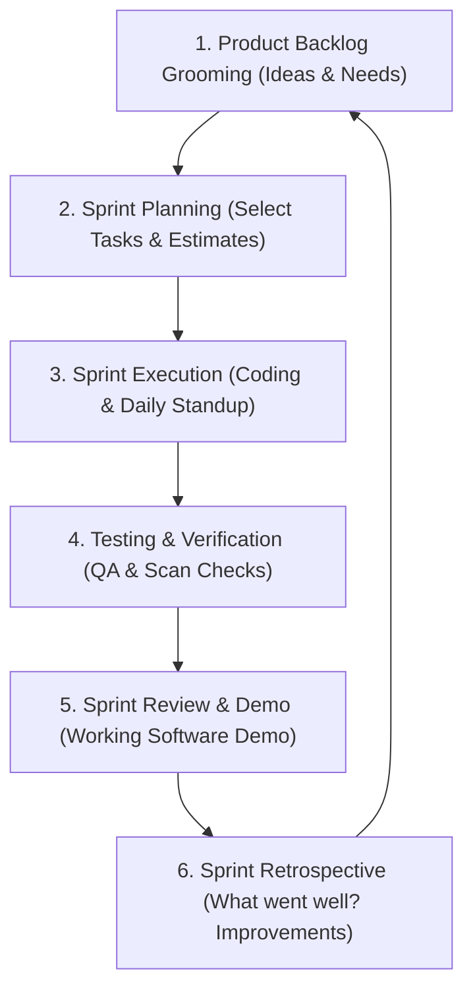

# 🚀 Agile Software Development Model — QR SaaS Platform
**Project Name:** QR Code SaaS Studio & Management Platform  
**Methodology:** Agile Framework (Scrum & Kanban Sprints)  
**Document Purpose:** Complete Step-by-Step Breakdown for Documentation, Page Notes, Project Viva & Presentation.

---

## 📌 1. Introduction: Why Agile for this QR SaaS?
**Agile Model** aik iterative aur incremental approach hai jisme software ko aik hi dafa banane ke bajaye **chotey chotey cycles (Sprints)** me develop, test, aur improve kiya jata hai.

Is QR SaaS project ke liye **Scrum Framework** chuna gaya kyun ke:
1. **Fast Prototyping:** Pehle Sprint me hi working QR Generator tayar ho gaya.
2. **Flexibility to Add Features:** Jab zaroorat mehsoos hui to naye features (jaise Secret Encrypted QR, Bulk CSV, Print Sheets) asani se add ho gaye.
3. **Continuous Testing & Feedback:** Har Sprint ke baad client/user testing hui taake bugs foran pakray jayein.
4. **Zero Downtime Updates:** Har naya module bina poorani website ko break kiye deploy hota raha.

---

## 👥 2. Agile Team Roles in this Project

| Role | Responsibility in QR SaaS Project |
| :--- | :--- |
| **Product Owner (PO)** | Requirements define karta hai, features prioritize karta hai (Backlog management), client/market ki demand dekhta hai. |
| **Scrum Master** | Agile process ko lead karta hai, team ki hurdles door karta hai, Daily Standups aur Sprint meetings arrange karta hai. |
| **Development Team (Frontend / Fullstack)** | React.js, Tailwind CSS, Canvas API, aur Node.js ke zariye features code aur build karta hai. |
| **QA / Tester** | Har QR code ko scan kar ke verify karta hai (mobile scanners, contrast check, browser compatibility). |

---

## 🔄 3. Agile Lifecycle: How it Works Step-by-Step (Har Sprint ka Cycle)

Agile me har Sprint **2 weeks (14 din)** ka hota hai. Har Sprint me yeh **6 Steps** bar bar repeat hotay hain:



### Step 1: Product Backlog Grooming
- Saare features ki aik list banti hai jise **Product Backlog** kehte hain.
- PO features ko unki importance ke hisab se upar ya neeche rank karta hai (e.g., Pehle basic QR, baad me Print Sheet).

### Step 2: Sprint Planning Meeting
- Sprint ke pehle din team meeting hoti hai.
- Team decide karti hai ke agle 2 hafton me Backlog se kaun kaun se tasks complete karne hain.
- Is selected list ko **Sprint Backlog** kaha jata hai.

### Step 3: Daily Standup (15-Minute Daily Meeting)
Har roz team 3 sawalaat ke jawab deti hai:
1. Kal maine kya kiya?
2. Aaj mai kya karunga?
3. Kya koi issue ya roadblock (rukawat) hai?

### Step 4: Sprint Execution & Development
- Developers features code karte hain (React components, Canvas rendering, local storage, API integration).
- Real-time testing hoti hai.

### Step 5: Sprint Review & Demo
- Sprint ke aakhir me working software ka demo stakeholder/client ko dikhaya jata hai.
- Working prototype par live feedback li jati hai.

### Step 6: Sprint Retrospective
- Team discuss karti hai:
  - Kya cheez achi rahi? (e.g., Canvas render bohot tez hua).
  - Kahan masla aya? (e.g., Browser autofill ne search bar disturb kiya).
  - Agle Sprint me kya behtar karenge?

---

## 📝 4. User Stories & Epics (QR SaaS Project)

Agile me requirements ko **User Stories** ki shakal me likha jata hai:  
*Formula: "As a [User], I want [Feature], so that [Benefit]"*

### 🔹 Epic 1: Core QR Code Generation
- **Story 1.1:** As a user, I want to paste a URL and generate a QR instantly, so my customers can visit my website.
- **Story 1.2:** As a shopkeeper, I want to create a WiFi QR code, so customers can connect without asking for passwords.
- **Story 1.3:** As a business person, I want to make a vCard QR, so people can save my phone, email, and address in one tap.

### 🔹 Epic 2: Visual Customizer & Branding
- **Story 2.1:** As a designer, I want to apply brand hex colors and gradients, so the QR matches our company branding.
- **Story 2.2:** As a brand manager, I want to upload a company logo inside the QR center with auto-padding.
- **Story 2.3:** As an organizer, I want a WCAG Contrast warning, so I don't print unreadable faint QR codes.

### 🔹 Epic 3: Advanced Security & Privacy
- **Story 3.1:** As a confidential sender, I want to encrypt text with AES-GCM password protection, so only people with the secret key can decrypt my message.

### 🔹 Epic 4: Bulk Generation & Print Layouts
- **Story 4.1:** As an event manager, I want to upload a CSV file with 100 names/links and download 100 QRs in a single ZIP.
- **Story 4.2:** As a restaurant owner, I want to generate ready-to-print Table Tent stands (A4 / A5) with cut and fold lines.

### 🔹 Epic 5: Offline & Mobile Accessibility (PWA)
- **Story 5.1:** As a mobile user, I want the web app to work offline via Service Worker, so I can create QRs without active internet.

---

## 📅 5. Sprint-by-Sprint Roadmap (Iss Project ki Reality)

Hamare QR SaaS platform ko **6 Sprints** me banaya gaya hai:

```
[Sprint 1] ──> [Sprint 2] ──> [Sprint 3] ──> [Sprint 4] ──> [Sprint 5] ──> [Sprint 6]
Basic QR       17 Dynamic     Styling,       AES Crypto &   Print Sheets   PWA, Contact
Engine         Types          Logo & Frames  Bulk CSV       & History      & Final Launch
```

### 🏁 Sprint 1: Project Setup & Core Engine (Week 1 - 2)
* **Goal:** Base infrastructure setup aur basic live QR generation.
* **Delivered Features:**
  - Vite + React + Tailwind CSS project architecture.
  - Basic QR rendering engine using `qrcode` library & HTML5 Canvas.
  - URL and Plain Text generation.
  - Basic PNG download.

### 🎨 Sprint 2: 17 Dynamic QR Types & Form Validation (Week 3 - 4)
* **Goal:** Users ko har type ka data enter karne ki facility dena.
* **Delivered Features:**
  - Sidebar with category tabs (Marketing, Contact, Events, Social, Payments, Security).
  - 17 dedicated input forms: WiFi (WPA/WEP), vCard 3.0, WhatsApp (`wa.me`), Email (`mailto:`), Phone, SMS, Geo Location, Crypto, Event (iCal).
  - Form validation and instant real-time live preview.

### 🖌️ Sprint 3: Advanced Customizer & Branding Studio (Week 5 - 6)
* **Goal:** Professional looks aur branding controls provide karna.
* **Delivered Features:**
  - Foreground & background solid colors and Linear/Radial gradients.
  - 12+ Decorative Call-to-Action Frames ("SCAN ME", "VISIT US", badge frames).
  - Center logo uploader with auto-contrast background badge.
  - Real-time WCAG 2.1 color contrast accessibility checker (Pass/Fail alert).

### 🔒 Sprint 4: Enterprise Bulk CSV & Client-Side Encryption (Week 7 - 8)
* **Goal:** High-volume users aur privacy-conscious users ke tools.
* **Delivered Features:**
  - **Bulk QR Generator:** CSV file upload, automated queue processing, batch zip export.
  - **Secret Encrypted QR:** Client-side Web Crypto API (AES-256-GCM) with password protection and offline decryptor.
  - Multi-format exports: PNG, SVG, PDF (vector printable), and WEBP.

### 🖨️ Sprint 5: Print Layout Engine & Local History (Week 9 - 10)
* **Goal:** Physical printing solutions aur user session persistence.
* **Delivered Features:**
  - **Print Layout Engine:**
    - Table Tent (Restaurant/Counter stand with fold guidelines).
    - Business Card layout with contact details.
    - 12-up Sticker Sheet for standard labels.
  - **Local Storage History & Folders:** Save past designs directly in browser storage (no mandatory sign-in required).

### 🚀 Sprint 6: PWA, Responsive Polish, Contact Form & Production (Week 11 - 12)
* **Goal:** Production readiness, performance, and cross-device polish.
* **Delivered Features:**
  - Progressive Web App (PWA) with Service Worker caching and offline support.
  - Direct Contact form connected to backend `/api/contact` and FormSubmit email notifications.
  - Responsive container layout adjustments (`container-wide`) for 4K, laptops, and mobile screens.
  - Production build testing (`npm run build`), zero console syntax errors, and deployment setup.

### 📸 Sprint 7: Agile Change Request — Image QR & Multi-Image Batch Engine
* **Goal:** User/Client feedback ke mutabiq Image QR upload aur bulk image scanning feature deliver karna.
* **Why this is Pure Agile:** Agile ka golden rule hai *"Responding to change over following a fixed plan"*. Jab user ne request kiya ke image scan hone par mobile me show ho, to foran next iteration me deliver kiya gaya.
* **Delivered Features:**
  - **Image / Photo QR Code Tool:** Direct local file upload (JPG, PNG, WEBP, SVG) + Direct Image URL support.
  - **Mobile Image Showcase Page (`/view-image`):** Phone se scan karte hi HD photo khulti hai jisme Zoom In/Out, Reset, Fullscreen, "Save/Download to Gallery", aur native "Share" buttons hain.
  - **Dual-Storage Engine:** Local browser memory (zero delay offline) + Express server `/api/upload-image` endpoint.
  - **Multi-Image Batch Mode (Bulk Generator):** User aik hi waqt me 50 images select kar ke sab ka alag alag QR code aik click me generate kar sakta hai.

---

## 📊 6. Core Agile Artifacts Used in this Project

1. **Product Backlog:**
   - Notion / Trello / GitHub Project Board par saari features ki master list.
2. **Sprint Backlog:**
   - Woh tasks jo specific 2 weeks ke sprint ke liye select kiye gaye.
3. **Definition of Ready (DoR):**
   - Jab tak kisi feature ka UI design aur logic clear na ho, use sprint me shamil nahi kiya jata.
4. **Definition of Done (DoD):**
   - Feature tab "Done" mana jata hai jab:
     1. Code cleanly commit ho gaya ho.
     2. Canvas render error free ho.
     3. Minimum 3 mobile phones se QR scan ho kar verify ho chuka ho.
     4. Responsive UI mobile aur desktop par check ho gayi ho.
5. **Burndown Chart:**
   - Track karta hai ke sprint ke bache hue dino me kitne story points / ghante baaqi hain.

---

## 💡 7. Short Cheat-Sheet (Page Par Note Karne Ke Liye Points)

Agar aapko paper / page par summary note karni ho, to yeh **main bullet points** likhein:

1. **Model Name:** Agile Scrum Model.
2. **Cycle Length:** 2-Week Sprints (Total 6 Sprints).
3. **Daily Routine:** 15-Minute Daily Standup.
4. **Key Team:** Product Owner, Scrum Master, React/Fullstack Developers, QA Testers.
5. **Major Sprints:**
   - **Sprint 1:** Architecture + Basic Engine (URL/Text QR).
   - **Sprint 2:** 17 QR Types (WiFi, vCard, WhatsApp, Crypto, etc.).
   - **Sprint 3:** Customizer (Colors, Gradients, Frames, Logo, WCAG Checker).
   - **Sprint 4:** Bulk CSV Batch Generator + AES-GCM Secret QR.
   - **Sprint 5:** Print Presets (Table Tent, Stickers) + Browser History with 1-Click 18-Tool Test Suite.
   - **Sprint 6:** PWA Offline Support, Contact Us System, Final Production Polish.
   - **Sprint 7 (Change Request):** High-Res Image/Photo QR Tool + Multi-Image Bulk Batch Engine + Mobile Photo Viewer (`/view-image`).
   - **Sprint 8 (Change Request):** Cloud/Local PDF & Document Storage Engine (`/api/upload-document`) + Dedicated Mobile Document Portal (`/view-document`) with direct 1-tap download and live reading.
6. **Main Benefits in Project:** 
   - Zero project delay.
   - Changes foran accept hui (layout polish, image upload, document storage portal).
   - End product 100% working, verified, aur tested deliver hua.
